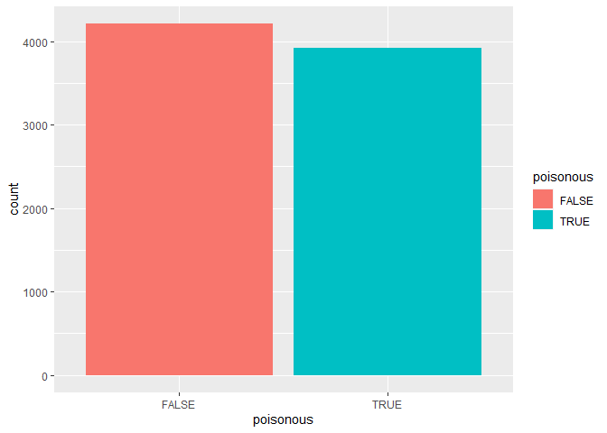
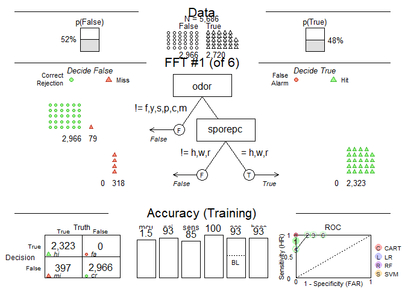
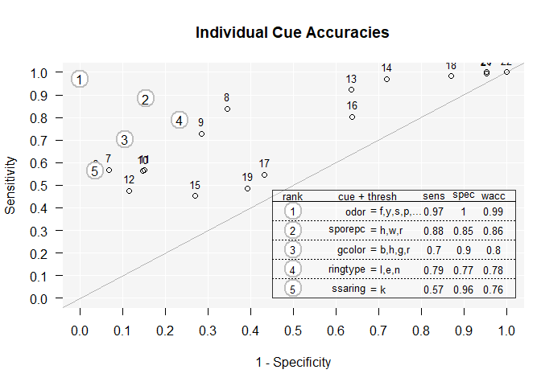

```r
require(datasets)
require(FFTrees)
require(randomForest)
require(ggplot2)
require(dplyr)
set.seed(1234)
head(mushrooms)
```

```
##   poisonous cshape csurface ccolor bruises odor gattach gspace gsize gcolor
## 1      TRUE      x        s      n       t    p       f      c     n      k
## 2     FALSE      x        s      y       t    a       f      c     b      k
## 3     FALSE      b        s      w       t    l       f      c     b      n
## 4      TRUE      x        y      w       t    p       f      c     n      n
## 5     FALSE      x        s      g       f    n       f      w     b      k
## 6     FALSE      x        y      y       t    a       f      c     b      n
##   sshape sroot ssaring ssbring scaring scbring vtype vcolor ringnum ringtype
## 1      e     e       s       s       w       w     p      w       o        p
## 2      e     c       s       s       w       w     p      w       o        p
## 3      e     c       s       s       w       w     p      w       o        p
## 4      e     e       s       s       w       w     p      w       o        p
## 5      t     e       s       s       w       w     p      w       o        e
## 6      e     c       s       s       w       w     p      w       o        p
##   sporepc population habitat
## 1       k          s       u
## 2       n          n       g
## 3       n          n       m
## 4       k          s       u
## 5       n          a       g
## 6       k          n       g
```


```r
ggplot(data = mushrooms, aes(poisonous, fill = poisonous)) + geom_bar()
```

<!-- -->


```r
rows <- sample(nrow(mushrooms), nrow(mushrooms) * 0.7, replace = FALSE)

train <- mushrooms[rows,]
test <- mushrooms[-rows,]
```


```r
model <- FFTrees(poisonous ~ ., data = train)
```

```
## Setting goal = 'wacc'
```

```
## Setting goal.chase = 'waccc'
```

```
## Setting cost.outcomes = list(hi = 0, mi = 1, fa = 1, cr = 0)
```

```
## Growing FFTs with ifan
```

```
## Fitting other algorithms for comparison (disable with do.comp = FALSE) ...
```

```r
model
```

```
## FFTrees 
## - Trees: 6 fast-and-frugal trees predicting poisonous
## - Outcome costs: [hi = 0, mi = 1, fa = 1, cr = 0]
## 
## FFT #1: Definition
## [1] If odor != {f,y,s,p,c,m}, decide False.
## [2] If sporepc != {h,w,r}, decide False, otherwise, decide True.
## 
## FFT #1: Training Accuracy
## Training Data: N = 5,686, Pos (+) = 2,720 (48%) 
## 
## |         | True +   | True -   |
## |---------|----------|----------|
## |Decide + | hi 2,323 | fa 0     | 2,323
## |Decide - | mi 397   | cr 2,966 | 3,363
## |---------|----------|----------|
##             2,720      2,966      N = 5,686
## 
## acc  = 93.0%  ppv  = 100.0%  npv  = 88.2%
## bacc = 92.7%  sens = 85.4%  spec = 100.0%
## E(cost) = 0.070
## 
## FFT #1: Training Speed and Frugality
## mcu = 1.46, pci = 0.93
```

```r
plot(model)
```

<!-- -->

```r
plot(model, what = "cues")
```

<!-- -->


```r
pred <- predict(model, test)
table(pred, test$poisonous)
```

```
##        
## pred    FALSE TRUE
##   FALSE  1242  171
##   TRUE      0 1025
```

